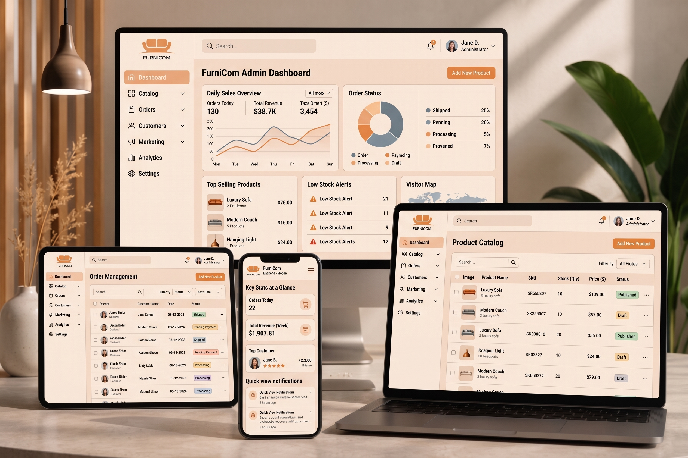

<div align="center">

# 🎓 CampusDev Education — EduWeb


**বাংলাদেশের স্কুল, কলেজ ও মাদ্রাসার জন্য আধুনিক, প্রিমিয়াম এবং PWA-ready ওয়েব অ্যাপ্লিকেশন।**

> 📚 **Education (শিক্ষা)** ✕ 🌐 **Web Technology (প্রযুক্তি)** = **EduWeb**

---

### 🖥️📱 Multi-Device Admin Panel Showcase


</div>

---

## 📋 বিষয়সূচি

- [প্রজেক্ট সম্পর্কে](#-প্রজেক্ট-সম্পর্কে)
- [ব্র্যান্ড পরিচয়](#️-ব্র্যান্ড-পরিচয়)
- [মূল ফিচারসমূহ](#-মূল-ফিচারসমূহ)
- [পেজ ও সেকশন](#-পেজ-ও-সেকশন)
- [সার্ভিস ক্যাটাগরি](#-সার্ভিস-ক্যাটাগরি)
- [টেকনোলজি স্ট্যাক](#️-টেকনোলজি-স্ট্যাক)
- [ডিজাইন সিস্টেম — রং, থিম ও ফন্ট](#-ডিজাইন-সিস্টেম--রং-থিম-ও-ফন্ট)
- [প্রজেক্ট আর্কিটেকচার](#-প্রজেক্ট-আর্কিটেকচার)
- [কম্পোনেন্ট গাইড](#-কম্পোনেন্ট-গাইড)
- [ডেটা লেয়ার](#-ডেটা-লেয়ার)
- [PWA ও সার্ভিস ওয়ার্কার](#-pwa-ও-সার্ভিস-ওয়ার্কার)
- [পারফরম্যান্স ও নিরাপত্তা](#-পারফরম্যান্স-ও-নিরাপত্তা)
- [কিভাবে চালাবেন](#-কিভাবে-চালাবেন)
- [পরিবেশ কনফিগারেশন](#️-পরিবেশ-কনফিগারেশন)
- [ডিপ্লয়মেন্ট](#-ডিপ্লয়মেন্ট)
- [সমর্থিত ব্রাউজার](#-সমর্থিত-ব্রাউজার)
- [লাইসেন্স](#-লাইসেন্স)

---

## 🌟 প্রজেক্ট সম্পর্কে

**EduWeb** (CampusDev Education) হলো বাংলাদেশের শিক্ষাপ্রতিষ্ঠানগুলোর জন্য একটি **সম্পূর্ণ ডিজিটাল ওয়েব সল্যুশন প্ল্যাটফর্ম**। Next.js 16 App Router এবং React 19 ব্যবহার করে তৈরি এই প্ল্যাটফর্মটি স্কুল, কলেজ ও মাদ্রাসার ডিজিটাল রূপান্তরে সহায়তা করে।

### এই প্রজেক্টে রয়েছে:

| ফিচার | বিবরণ |
|-------|--------|
| 🏫 **শিক্ষাপ্রতিষ্ঠান টাইপ** | স্কুল, কলেজ, মাদ্রাসা, কোচিং সেন্টার — সকল প্রতিষ্ঠানের জন্য কাস্টম সল্যুশন |
| 📊 **ইন্টারেক্টিভ অ্যাডমিন ডেমো** | লাইভ অ্যাডমিন প্যানেল ডেমো — রেজাল্ট, ফি, নোটিশ, হাজিরা, ভর্তি ব্যবস্থাপনা |
| 🌐 **দ্বি-ভাষিক (BN/EN)** | সম্পূর্ণ বাংলা ও ইংরেজি ইন্টারফেস — রিয়েল-টাইম ভাষা সুইচ |
| 📱 **PWA + নেটিভ অ্যাপ ফিল** | মোবাইলে ইনস্টলযোগ্য, অফলাইন সাপোর্ট সহ নেটিভ অ্যাপের মতো অভিজ্ঞতা |
| 💬 **ইন্টারেক্টিভ মোডাল সিস্টেম** | Audit, Consultation, Project Estimator ও Case Study Modal |

---

## 🏷️ ব্র্যান্ড পরিচয়

| স্তম্ভ | পূর্ণ রূপ | ভূমিকা |
|--------|-----------|--------|
| 📚 **Edu** | Education | বাংলাদেশের সকল শিক্ষাপ্রতিষ্ঠানের সেবায় নিবেদিত |
| 🌐 **Web** | Web Technology | আধুনিক ওয়েব প্রযুক্তি দ্বারা চালিত |

**EduWeb = শিক্ষা ✕ প্রযুক্তি** — দুটি মূল শক্তির সমন্বয়েই আমাদের পরিচয়।  
*এই প্ল্যাটফর্মটি তৈরি করেছে **CampusDev** টিম।*

---

## ✨ মূল ফিচারসমূহ

### 📱 নেটিভ অ্যাপ ফিল — App Shell & Navigation

| কম্পোনেন্ট | বিবরণ |
|-----------|--------|
| `MobileBottomNav.tsx` | মোবাইলে ফিক্সড বটম ট্যাব বার — Home, Services, Demos, Pricing, Contact |
| `TabletBottomNav.tsx` | ট্যাবলেটে ৬-ট্যাব স্পেশাল নেভিগেশন + ভিজ্যুয়াল অ্যাক্টিভ ইনডিকেটর |
| `Navbar.tsx` | স্ক্রোলে auto shrink/hide — YouTube-স্টাইল গ্লাস টপ বার |
| `PullToRefresh.tsx` | রাবার-ব্যান্ড ইফেক্ট সহ Touch Pull-to-Refresh |
| **Swipe Gestures** | বাম/ডান সোয়াইপে পেজ নেভিগেশন (৯টি সেকশন) |

### ⚡ অ্যানিমেশন ও পেজ ট্রানজিশন

- 🌈 **Zero Reload Transitions** (`PageTransition.tsx`) — Scale + Fade এনিমেশন সহ মসৃণ পেজ সুইচিং
- 🎨 **Institutional Design System** — Royal Blue `#003B73` / Dark Navy `#0C1929` কালার থিম
- 👁️ **WCAG AAA Readability** — সর্বোচ্চ কনট্রাস্ট ও অ্যাক্সেসিবিলিটি
- 🖱️ **Micro-animations** — Hover, Press, Active Scale (`active:scale-95`), Safe Area Insets

### 🚀 পারফরম্যান্স অপ্টিমাইজেশন

- 📦 **Dynamic Code-Splitting** — `next/dynamic` দিয়ে ভারী ভিউ ও মোডালসমূহ Lazy লোড
- 💀 **Skeleton Loading** — কনটেন্ট লোডের আগে গ্লাস স্কেলেটন প্রিভিউ
- 🖼️ **Image Optimization** — AVIF + WebP ফরম্যাট, Edge CDN সমর্থন
- 🗜️ **CSS Optimization** — `optimizeCss: true` এবং Critters দিয়ে critical CSS inline

### 🔒 নিরাপত্তা

- ✅ `X-Content-Type-Options: nosniff`
- ✅ `X-Frame-Options: DENY`
- ✅ `X-XSS-Protection: 1; mode=block`
- ✅ `Referrer-Policy: strict-origin-when-cross-origin`
- ✅ `Permissions-Policy` (camera, microphone, geolocation বন্ধ)
- ✅ SVG Content Security Policy

---

## 🗂️ পেজ ও সেকশন

মোট **৯টি সেকশন** রয়েছে, যেগুলো swipe gesture দিয়ে বা নেভিগেশন থেকে navigate করা যায়:

| # | সেকশন | ভিউ ফাইল | বিবরণ |
|---|--------|----------|--------|
| 1 | 🏠 **Home** | `HomeView.tsx` | স্প্লিট-লেআউট হিরো, ইন্টারেক্টিভ স্কুল/কলেজ/মাদ্রাসা প্রিভিউ ট্যাব, সার্ভিস কার্ড, কেস স্টাডি, টেস্টিমোনিয়াল, FAQ |
| 2 | 🛠️ **Services** | `ServicesView.tsx` | সকল সার্ভিস বিস্তারিত — ফিল্টারেবল ক্যাটাগরি |
| 3 | 💼 **Works** | `WorksView.tsx` | পোর্টফোলিও ও কেস স্টাডি গ্যালারি |
| 4 | 🖥️ **Demos** | `DemosView.tsx` | লাইভ ইন্টারেক্টিভ অ্যাডমিন প্যানেল ডেমো |
| 5 | 💰 **Pricing** | `PricingView.tsx` | ওয়েবসাইট বিল্ড + মাসিক কেয়ার প্ল্যান |
| 6 | 🔄 **Process** | `ProcessView.tsx` | কাজের ধাপ ও ওয়ার্কফ্লো |
| 7 | ℹ️ **About** | `AboutView.tsx` | টিম, মিশন ও ভিশন |
| 8 | 📰 **Resources** | `BlogResourcesView.tsx` | ব্লগ, গাইড ও রিসোর্স |
| 9 | 📞 **Contact** | `ContactView.tsx` | যোগাযোগ ফর্ম ও তথ্য |

### 🔲 মোডাল সিস্টেম

| মোডাল | ফাইল | উদ্দেশ্য |
|--------|------|---------|
| 🔍 **Website Audit** | `WebsiteAuditModal.tsx` | বিদ্যমান ওয়েবসাইটের বিনামূল্যে অডিট রিপোর্ট |
| 💬 **Consultation** | `ConsultationModal.tsx` | বিনামূল্যে পরামর্শ বুকিং |
| 📐 **Project Estimator** | `ProjectEstimatorModal.tsx` | ইন্টারেক্টিভ বাজেট ক্যালকুলেটর |
| 📁 **Case Study** | `CaseStudyModal.tsx` | বিস্তারিত প্রজেক্ট কেস স্টাডি ভিউয়ার |

---

## 🏫 সার্ভিস ক্যাটাগরি

| ক্যাটাগরি | আইডি | টার্গেট |
|-----------|------|---------|
| 🎓 **স্কুল ওয়েবসাইট সল্যুশন** | `school-website` | উচ্চ বিদ্যালয়, মডেল স্কুল, ক্যাডেট একাডেমি |
| 🏛️ **কলেজ ওয়েবসাইট পোর্টাল** | `college-website` | সরকারি/বেসরকারি কলেজ, ডিগ্রি মহাবিদ্যালয় |
| 📖 **মাদ্রাসা পোর্টাল সল্যুশন** | `madrasa-website` | কওমি, আলিয়া, হিফজখানা, ইসলামিক একাডেমি |
| ⚙️ **কোচিং ও ট্রাস্ট একাডেমি** | `custom-website` | মেডিকেল/ইঞ্জিনিয়ারিং কোচিং, আইটি ট্রেনিং |
| 🛡️ **সার্ভার কেয়ার ও মেইনটেন্যান্স** | `maintenance-care` | যেকোনো প্রতিষ্ঠান, দীর্ঘমেয়াদী সাপোর্ট |

---

## 🛠️ টেকনোলজি স্ট্যাক

| স্তর | প্রযুক্তি | সংস্করণ |
|-----|----------|---------|
| **Framework** | Next.js (App Router) | 16.3.5 |
| **UI Library** | React | 19.2.8 |
| **Language** | TypeScript | 5.x |
| **Styling** | Tailwind CSS + Custom CSS Variables | v4 |
| **Animation** | Motion (Framer Motion) | ^12.23.24 |
| **Icons** | Lucide React | ^0.546.0 |
| **Fonts** | Bricolage Grotesque, Mulish, Hind Siliguri | Google Fonts |
| **PWA** | Custom Service Worker | — |
| **CSS Opt.** | Critters (Critical CSS inline) | ^0.0.23 |
| **Linter** | ESLint | ^9 |
| **Node.js** | Minimum requirement | ≥ 20.9.0 |

---

## 🎨 ডিজাইন সিস্টেম — রং, থিম ও ফন্ট

> **Palette Name:** *"Study Hall"* — Chalkboard Pine + Confident Academic Green + Marigold Gold  
> **Source files:** `app/globals.css` (2000 lines) · `style.css` (1020 lines)

---

### 🌿 কালার প্যালেট (CSS Custom Properties)

#### Primary Colors

| Token | Hex | সোয়াচ | ব্যবহার |
|-------|-----|-------|--------|
| `--ink` | `#14342b` |  | Deep Chalkboard Pine — হেডিং, ফুটার, ডার্ক সারফেস |
| `--ink-soft` | `#2b4a40` |  | Body text, softer dark surfaces |
| `--brand` | `#1e7a50` |  | Confident Academic Green — primary CTA, links, icons |
| `--brand-600` | `#17663f` |  | Hover state of brand green |
| `--brand-tint` | `#e7f2ea` |  | Soft mint wash — chip/badge backgrounds |
| `--brand-tint2` | `#cfe4d6` |  | Deeper mint — active step bg |

#### Accent Colors

| Token | Hex | সোয়াচ | ব্যবহার |
|-------|-----|-------|--------|
| `--gold` | `#f2a93b` |  | Marigold — স্টার রেটিং, badge, Teach CTA |
| `--gold-600` | `#e0972a` |  | Gold hover / darker accent |
| `--coral` | `#e8674c` |  | Price / hot accent — sparing use only |

#### Surface & Background Colors

| Token | Hex | সোয়াচ | ব্যবহার |
|-------|-----|-------|--------|
| `--paper` | `#f4f6f2` |  | Page background — faint green bias |
| `--card` | `#ffffff` |  | Card / panel background |
| `--line` | `#e2e8de` |  | Border / divider color |
| `--line-soft` | `#eef2ec` |  | Subtle border — hover states |

#### Text Colors

| Token | Hex | সোয়াচ | ব্যবহার |
|-------|-----|-------|--------|
| `--muted` | `#57685e` |  | Secondary text |
| `--muted-2` | `#7c8b82` |  | Placeholder / tertiary text |

#### Semantic Colors

| Token | Hex | সোয়াচ | ব্যবহার |
|-------|-----|-------|--------|
| `--color-success` | `#1e7a50` |  | Success states (= brand green) |
| `--color-warning` | `#f2a93b` |  | Warning / alert |
| `--color-danger` | `#e8674c` |  | Error / destructive action |

---

### 🌙 থিম — Light vs Dark

প্রজেক্টে **দুটি থিম** রয়েছে:

#### ☀️ Light Theme (Default — `:root`)

```
Background  →  #f4f6f2  (--paper)       faint green-biased off-white
Surface     →  #ffffff  (--card)        pure white cards
Foreground  →  #14342b  (--ink)         deep pine for headings
Body text   →  #2b4a40  (--ink-soft)    slightly lighter pine
Border      →  #e2e8de  (--line)        soft green-grey dividers
```

#### 🌑 Dark Theme (`.theme-ink` class)

```
Background  →  #14342b                  deep chalkboard pine
Surface     →  #1c4237                  raised dark card surface
Foreground  →  #ffffff                  pure white text
Body text   →  rgba(255,255,255, .85)   slightly dimmed white
Muted       →  rgba(255,255,255, .70)   secondary dark-mode text
Border      →  rgba(255,255,255, .12)   translucent white lines
```

**Dark theme কোথায় ব্যবহৃত হয়:**
- `Navbar.tsx` — top navigation bar (`rgba(20,52,43,.88)` glass)
- `MobileBottomNav.tsx` — bottom tab bar (`rgba(20,52,43,.94)` glass)
- Hero section — `hero-glow` radial gradient background
- Footer — full dark ink zone
- Dropdown drawers — `linear-gradient(145deg, rgba(20,52,43,.98), rgba(10,26,20,.98))`

---

### 🔤 টাইপোগ্রাফি সিস্টেম

#### ফন্ট ফ্যামিলি (Google Fonts CDN)

| ভেরিয়েবল | ফন্ট | ব্যবহার | Weight Range |
|----------|------|--------|--------------|
| `--ff-display` / `--ff-heading` | **Bricolage Grotesque** | হেডিং, ব্র্যান্ড নাম, সেকশন টাইটেল | `200–800`, optical size `12–96` |
| `--ff-body` | **Mulish** | বডি টেক্সট, বাটন, লেবেল, নেভিগেশন | `200–1000` (italic সহ) |
| `--font-bengali` | **Hind Siliguri** | বাংলা ভাষার টেক্সট ব্লক | `400, 500, 600, 700` |

```css
/* Google Fonts লোড URL */
https://fonts.googleapis.com/css2?
  family=Bricolage+Grotesque:opsz,wght@12..96,200..800
  &family=Mulish:ital,wght@0,200..1000;1,200..1000
  &family=Hind+Siliguri:wght@400;500;600;700
  &display=swap
```

#### টাইপ স্কেল

| উপাদান | ফন্ট | সাইজ | Weight | Letter Spacing |
|--------|------|------|--------|----------------|
| `h1` (Hero) | Bricolage Grotesque | `clamp(2.3rem, 5.4vw, 3.75rem)` | 800 | `-0.02em` |
| `h2` (Section) | Bricolage Grotesque | `clamp(1.7rem, 3.4vw, 2.5rem)` | 700 | `-0.02em` |
| `h3–h6` | Bricolage Grotesque | — | 700 | `-0.02em` |
| Body | Mulish | `1.0625rem` (17px) | 400–600 | normal |
| Kicker / Label | Mulish | `0.8rem` | 800 | `0.12em` |
| Bengali text | Hind Siliguri | inherit | 400–700 | normal |

#### Line Height

```css
body        →  line-height: 1.65
headings    →  line-height: 1.08
bengali     →  line-height: calc(1em + 4px)  /* extra space for vowel marks */
```

---

### 🌈 গ্র্যাডিয়েন্ট ও গ্লো ইফেক্ট

#### টেক্সট গ্র্যাডিয়েন্ট ক্লাস

| CSS Class | গ্র্যাডিয়েন্ট | ব্যবহার |
|-----------|-------------|--------|
| `.gradient-text` | `#1e7a50 → #17663f → #10261f` | প্রাইমারি ব্র্যান্ড হেডিং |
| `.gradient-text-navy` | `#14342b → #1e7a50` | Pine-to-green হেডিং |
| `.gradient-text-amber` | `#f2a93b → #FCD34D → #e0972a` | Gold/Marigold অ্যাকসেন্ট |

#### হিরো ব্যাকগ্রাউন্ড গ্র্যাডিয়েন্ট

```css
/* Light Hero (.premium-hero) */
radial-gradient(120% 90% at 85% -10%, rgba(242,169,59,.10), transparent 55%),
radial-gradient(90% 80% at 5%  0%,  rgba(30,122,80,.08),  transparent 50%),
var(--paper)

/* Dark Hero (.hero-glow) */
radial-gradient(120% 90% at 85% -10%, rgba(242,169,59,.10), transparent 55%),
radial-gradient(90% 80% at 5%  0%,  rgba(30,122,80,.12),  transparent 50%),
var(--ink)
```

#### Glassmorphism (Navbar / BottomNav)

```css
backdrop-filter: blur(12px) saturate(160%);
background: rgba(20,52,43,.88);   /* top navbar */
background: rgba(20,52,43,.94);   /* mobile bottom bar */
```

---

### 📐 শেপ ও শ্যাডো টোকেন

#### Border Radius

| Token | Value | ব্যবহার |
|-------|-------|---------|
| `--radius` / `--radius-card` | `18px` | কার্ড, ইনপুট |
| `--radius-sm` | `12px` | ছোট কম্পোনেন্ট |
| `--radius-xl` | `26px` | ডেমো ফ্রেম, বড় কার্ড |
| `--radius-pill` / `--radius-full` | `999px` | বাটন, চিপ, ব্যাজ |

#### Shadow System

| Token | Value | ব্যবহার |
|-------|-------|---------|
| `--shadow-sm` | `0 2px 8px rgba(20,52,43,.05)` | Subtle card lift |
| `--shadow-md` | `0 14px 34px rgba(20,52,43,.10)` | Floating card |
| `--shadow-lg` | `0 26px 60px rgba(20,52,43,.16)` | Hero image frame |
| `--shadow-glow` | `0 0 0 1px brand, 0 12px 30px -4px rgba(30,122,80,.25)` | Brand glow ring |
| `--shadow-glow-wide` | `0 8px 32px -8px rgba(30,122,80,.22), 0 2px 8px rgba(20,52,43,.06)` | Wide ambient glow |

---

### ✨ অ্যানিমেশন ও মোশন ইউটিলিটি

| Class / Keyframe | ব্যবহার | Duration |
|-----------------|--------|---------|
| `@keyframes float` | Hero metric কার্ডের floating effect | `translateY(0 → -8px)` |
| `@keyframes live-pulse` | Live sync dot — scale + opacity | `2s infinite` |
| `@keyframes glow-pulse` | Brand glow dot animation | `2s infinite` |
| `@keyframes shine` | বাটনে shimmer shine sweep | `3.5s infinite` |
| `@keyframes fadeIn` | Section fade-in on mount | `0.4s ease-out` |
| `.glass-nav` | Glassmorphism backdrop filter | `blur(12px) saturate(160%)` |
| `.shine-effect` | বাটন shine overlay | `skewX(-20deg)` sweep |
| `.glow-dot` | Pulsing brand indicator dot | `8px` circle |

---

### 🎨 Scrollbar Styling

```css
::-webkit-scrollbar-thumb {
  background: linear-gradient(var(--brand), var(--brand-600));  /* green gradient */
  border-radius: 9999px;
}
/* Track: var(--paper) — #f4f6f2 */
/* Width: 6px */
```

---

### 🖱️ ইন্টারেক্টিভ স্টেট

```css
/* All interactive elements */
transition: color 180ms ease,
            background-color 180ms ease,
            border-color 180ms ease,
            box-shadow 220ms ease,
            transform 220ms cubic-bezier(0.2, 0.8, 0.2, 1);

button:active  →  transform: scale(0.985)
::selection    →  background: rgba(30,122,80,.25) — brand green tint
:focus-visible →  outline: 2px solid var(--brand), offset: 3px
```

---

## 📁 প্রজেক্ট আর্কিটেকচার

```
next-app/                            # প্রজেক্ট রুট
│
├── app/                             # Next.js 16 App Router
│   ├── layout.tsx                   # Root Layout — PWA মেটা, ফন্ট, SEO, Apple splash
│   ├── page.tsx                     # Main SPA Shell — রাউটিং, সোয়াইপ, PTR, স্টেট
│   ├── globals.css                  # Global Design System (47 KB) — tokens, keyframes
│   └── favicon.ico                  # অ্যাপ আইকন
│
├── components/                      # React কম্পোনেন্টস
│   ├── ui/                          # Reusable UI Primitives
│   │   ├── Button.tsx               # Primary / Secondary / Ghost / Outline ভেরিয়েন্ট
│   │   ├── Card.tsx                 # Glass card, hover effects
│   │   ├── SectionHeader.tsx        # গ্র্যাডিয়েন্ট হেডার টাইটেল
│   │   ├── Badge.tsx                # স্ট্যাটাস ব্যাজ ও লেবেল
│   │   ├── GlassPanel.tsx           # Glassmorphism কনটেইনার
│   │   └── index.ts                 # Barrel export
│   │
│   ├── Navbar.tsx                   # স্ক্রোল-শ্রিংকিং টপ নেভিগেশন (24 KB)
│   ├── MobileBottomNav.tsx          # মোবাইল বটম ট্যাব বার
│   ├── TabletBottomNav.tsx          # ট্যাবলেট অপ্টিমাইজড বটম নেভ
│   ├── Footer.tsx                   # Full institutional footer
│   ├── Logo.tsx                     # EduWeb লোগো কম্পোনেন্ট
│   ├── PageTransition.tsx           # পেজ ট্রানজিশন র‍্যাপার
│   ├── PullToRefresh.tsx            # Touch pull-to-refresh
│   ├── PWAInstallBanner.tsx         # PWA install প্রম্পট ব্যানার
│   ├── HeroGlobe.tsx                # হিরো সেকশন গ্লোব ভিজ্যুয়াল
│   ├── AdminDemoInteractive.tsx     # লাইভ অ্যাডমিন প্যানেল ডেমো (34 KB)
│   ├── WebsiteAuditModal.tsx        # ওয়েবসাইট অডিট টুল
│   ├── ProjectEstimatorModal.tsx    # বাজেট এস্টিমেটর (25 KB)
│   ├── ConsultationModal.tsx        # পরামর্শ বুকিং মোডাল
│   └── CaseStudyModal.tsx           # পোর্টফোলিও কেস স্টাডি ভিউয়ার
│
├── views/                           # Page-level ভিউ কম্পোনেন্ট (Dynamic Imports)
│   ├── HomeView.tsx                 # হোমপেজ — হিরো, সার্ভিস, কেসস্টাডি (58 KB)
│   ├── ServicesView.tsx             # সার্ভিস ক্যাটালগ
│   ├── WorksView.tsx                # পোর্টফোলিও গ্যালারি
│   ├── DemosView.tsx                # অ্যাডমিন ডেমো শোকেস
│   ├── PricingView.tsx              # মূল্য তালিকা + কেয়ার প্ল্যান
│   ├── ProcessView.tsx              # কাজের প্রক্রিয়া ও ধাপ
│   ├── AboutView.tsx                # আমাদের সম্পর্কে
│   ├── BlogResourcesView.tsx        # ব্লগ ও রিসোর্স
│   └── ContactView.tsx              # যোগাযোগ (28 KB)
│
├── data/
│   └── content.ts                   # Multi-language কনটেন্ট ডিকশনারি (69 KB)
│
├── public/
│   ├── EduWebLogo.png               # অফিশিয়াল EduWeb ব্র্যান্ড লোগো
│   ├── hero-devices.png             # মাল্টি-ডিভাইস অ্যাডমিন শোকেস (2.1 MB)
│   ├── manifest.json                # PWA Web App Manifest
│   └── sw.js                        # Service Worker — Cache + Network strategies
│
├── types.ts                         # TypeScript Interfaces & Types
├── style.css                        # অতিরিক্ত গ্লোবাল স্টাইল (26 KB)
├── next.config.ts                   # Next.js কনফিগারেশন
├── postcss.config.mjs               # PostCSS + Tailwind CSS v4
└── tsconfig.json                    # TypeScript কনফিগারেশন
```

---

## 🧩 কম্পোনেন্ট গাইড

### `app/page.tsx` — Main Application Shell

এটি পুরো অ্যাপের কেন্দ্রীয় অর্কেস্ট্রেটর। এতে রয়েছে:

- **State Management**: `currentSection`, `language`, `isNavVisible`, মোডাল স্টেটসমূহ
- **Service Worker Registration**: `useServiceWorker()` হুক — production-only নিবন্ধন
- **Scroll Behavior**: YouTube-স্টাইল navbar hide/show (`requestAnimationFrame` দিয়ে throttled)
- **Swipe Navigation**: `onTouchStart`/`onTouchEnd` — ৬০px threshold, ২৪px edge zone guard
- **Dynamic Routing**: `NAV_ORDER` অ্যারে অনুযায়ী ৯টি সেকশন রেন্ডার
- **Lazy Loading**: সব ভিউ ও মোডাল `next/dynamic` দিয়ে `ssr: false`-তে লোড

### `data/content.ts` — Centralized Content Dictionary

সকল কনটেন্ট একটি centralized TypeScript ফাইলে সংরক্ষিত:

```typescript
export const SERVICES_DATA: ServiceItem[]        // ৫টি সার্ভিস প্যাকেজ
export const FEATURED_PROJECTS: CaseStudy[]      // পোর্টফোলিও কেস স্টাডি
export const PRICING_DATA: PricingPlan[]         // ওয়েবসাইট বিল্ড প্ল্যান
export const MAINTENANCE_DATA: MaintenanceTier[] // মাসিক কেয়ার প্ল্যান
export const TESTIMONIALS_DATA: Testimonial[]    // ক্লায়েন্ট টেস্টিমোনিয়াল
export const FAQS_DATA: FaqItem[]                // প্রশ্নোত্তর
export const WORKFLOW_STEPS                      // কাজের ধাপ
export const WHY_US_ITEMS                        // কেন আমরা বেছে নেবেন
```

প্রতিটি আইটেমে `Bn` (বাংলা) ও `En` (ইংরেজি) উভয় ফিল্ড রয়েছে।

### `types.ts` — TypeScript Type Definitions

```typescript
type Language = 'bn' | 'en'
type NavSection = 'home' | 'services' | 'works' | 'demos' | 'pricing' | 'process' | 'about' | 'resources' | 'contact'

interface ServiceItem      // সার্ভিস আইটেম স্ট্রাকচার
interface CaseStudy        // কেস স্টাডি + performance metrics + testimonial
interface PricingPlan      // মূল্য পরিকল্পনা
interface MaintenanceTier  // রক্ষণাবেক্ষণ টায়ার
interface Testimonial      // ক্লায়েন্ট রিভিউ + rating
interface FaqItem          // FAQ প্রশ্নোত্তর
interface AuditReport      // ওয়েবসাইট অডিট স্কোর রিপোর্ট
```

---

## 📱 PWA ও সার্ভিস ওয়ার্কার

এই অ্যাপটি **Progressive Web App** হিসেবে মোবাইল ও ট্যাবলেটে ইনস্টল করা যায়:

### `public/sw.js` — Service Worker কৌশল

| রিকোয়েস্ট টাইপ | কৌশল | বিবরণ |
|----------------|------|--------|
| নেভিগেশন (HTML) | **Network-first** | নেটওয়ার্ক ব্যর্থ হলে cache থেকে দেখায় |
| স্ট্যাটিক অ্যাসেট | **Cache-first** | `.png`, `.jpg`, `.svg`, `.woff2`, `.css`, `.js` |
| `/_next/*` chunks | **Bypass** | Fast Refresh compatibility রক্ষায় cache করা হয় না |

Cache Name: `campusdev-v2`

### `public/manifest.json` — PWA কনফিগারেশন

```json
{
  "name": "EduWeb",
  "short_name": "EduWeb",
  "display": "standalone",
  "lang": "bn",
  "categories": ["education", "business"],
  "shortcuts": [{ "name": "পরামর্শ নিন", "url": "/?section=contact" }]
}
```

### PWA ফিচারসমূহ

- 📲 **Custom Install Banner** (`PWAInstallBanner.tsx`) — প্রিমিয়াম অ্যানিমেটেড ইনস্টল প্রম্পট
- 📱 **iOS Splash Screen & Touch Icons** — Apple Safari standalone সমর্থন  
- 📐 **Safe Area Inset** — `env(safe-area-inset-bottom)` Notch/Dynamic Island সমর্থন
- 🎯 **Touch Target** — ন্যূনতম 44×44px স্পর্শ লক্ষ্যমাত্রা

### `app/layout.tsx` — SEO ও মেটা কনফিগারেশন

| মেটা টাইপ | কনফিগারেশন |
|----------|------------|
| **Title** | `EduWeb — শিক্ষা প্রতিষ্ঠানের প্রিমিয়াম ওয়েব সল্যুশন` |
| **OpenGraph** | `bn_BD` locale, `eduweb.com.bd` |
| **Twitter Card** | `summary_large_image` |
| **Apple Web App** | `statusBarStyle: black-translucent`, capable |
| **Google Fonts** | Bricolage Grotesque + Mulish + Hind Siliguri |
| **Viewport** | `viewportFit: cover`, `userScalable: false` |
| **Keywords** | Education website Bangladesh, school, madrasa, college portal |

---

## ⚡ পারফরম্যান্স ও নিরাপত্তা

### `next.config.ts` কনফিগারেশন

```typescript
{
  experimental: { optimizeCss: true },   // Critters দিয়ে critical CSS inline
  compress: true,                         // Gzip/Brotli কম্প্রেশন
  poweredByHeader: false,                 // X-Powered-By হেডার লুকানো
  reactStrictMode: true,                  // ডেভেলপমেন্টে strict mode
  images: {
    formats: ['image/avif', 'image/webp'], // আধুনিক ইমেজ ফরম্যাট
    dangerouslyAllowSVG: true,
  }
}
```

### নিরাপত্তা হেডার (সকল রুটে প্রযোজ্য)

```
X-Content-Type-Options: nosniff
X-Frame-Options: DENY
X-XSS-Protection: 1; mode=block
Referrer-Policy: strict-origin-when-cross-origin
Permissions-Policy: camera=(), microphone=(), geolocation=()
```

---

## 🚀 কিভাবে চালাবেন

### পূর্বশর্ত

- **Node.js ≥ 20.9.0** (Next.js 16 এর ন্যূনতম প্রয়োজনীয়তা)
- **npm** (package manager)

### ইনস্টলেশন ও ডেভেলপমেন্ট

```bash
# প্রজেক্ট ফোল্ডারে যান
cd next-app

# ডিপেন্ডেন্সি ইনস্টল করুন
npm install

# ডেভেলপমেন্ট সার্ভার চালু করুন
npm run dev
```

ব্রাউজারে খুলুন: **http://localhost:3000**

> **দ্রষ্টব্য:** ডেভেলপমেন্ট মোডে Service Worker স্বয়ংক্রিয়ভাবে unregister হয় — Fast Refresh compatibility রক্ষার জন্য।

### অন্যান্য কমান্ড

```bash
# প্রোডাকশন বিল্ড
npm run build

# প্রোডাকশন সার্ভার চালু
npm run start

# ESLint চেক
npm run lint

# TypeScript টাইপ চেক
npm run type-check
```

---

## ⚙️ পরিবেশ কনফিগারেশন

প্রজেক্ট রুটে `.env.local` ফাইল তৈরি করুন:

```env
# সাইটের পাবলিক URL
NEXT_PUBLIC_SITE_URL=https://eduweb.com.bd

# WhatsApp নম্বর (যোগাযোগ বাটনের জন্য)
NEXT_PUBLIC_WHATSAPP_NUMBER=8801XXXXXXXXX

# Contact Email (ফর্ম সাবমিশনের জন্য)
NEXT_PUBLIC_CONTACT_EMAIL=info@eduweb.com.bd
```

> `.env.local` ফাইলটি `.gitignore`-এ রয়েছে — কখনো রিপোতে push করবেন না।

---

## 🌐 ডিপ্লয়মেন্ট

### Vercel (প্রস্তাবিত)

```bash
# Vercel CLI ইনস্টল
npm i -g vercel

# ডিপ্লয় করুন
vercel --prod
```

### VPS / Self-hosted (PM2)

```bash
# প্রোডাকশন বিল্ড করুন
npm run build

# PM2 দিয়ে চালু করুন
npm install -g pm2
pm2 start npm --name "eduweb" -- start
pm2 save
pm2 startup
```

### Docker (Optional)

```dockerfile
FROM node:20-alpine AS builder
WORKDIR /app
COPY package*.json ./
RUN npm ci
COPY . .
RUN npm run build

FROM node:20-alpine AS runner
WORKDIR /app
COPY --from=builder /app/.next/standalone ./
COPY --from=builder /app/.next/static ./.next/static
COPY --from=builder /app/public ./public
EXPOSE 3000
CMD ["node", "server.js"]
```

---

## 🌍 সমর্থিত ব্রাউজার

Tailwind CSS v4 আধুনিক CSS features (`@property`, `color-mix()`, `@layer`) ব্যবহার করে:

| ব্রাউজার | ন্যূনতম সংস্করণ | সমর্থন |
|---------|----------------|--------|
| Chrome / Chromium | 111+ | ✅ সম্পূর্ণ |
| Microsoft Edge | 111+ | ✅ সম্পূর্ণ |
| Safari (iOS/macOS) | 16.4+ | ✅ PWA সহ |
| Firefox | 128+ | ✅ সম্পূর্ণ |
| Internet Explorer | — | ❌ সমর্থিত নয় |

---

## 📄 লাইসেন্স

```
UNLICENSED — মালিকানাধীন সফটওয়্যার
© 2026 CampusDev / EduWeb — সর্বস্বত্ব সংরক্ষিত
```

এই রিপোজিটরি **private** এবং মালিকানাধীন। অননুমোদিত ব্যবহার, বিতরণ বা পরিবর্তন সম্পূর্ণ নিষিদ্ধ।

---

<div align="center">

**Made with ❤️ by CampusDev Team**

*বাংলাদেশের শিক্ষাপ্রতিষ্ঠানের ডিজিটাল রূপান্তরে আমরা প্রতিশ্রুতিবদ্ধ*

📚 **Education** ✕ 🌐 **Web Technology** = **EduWeb**

[](https://nextjs.org)
[](https://react.dev)
[](https://typescriptlang.org)

</div>
